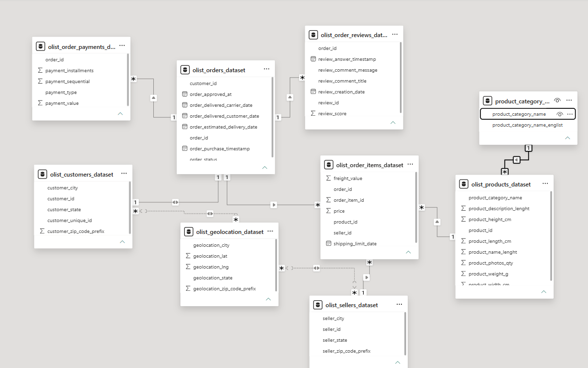

# Tables (Star Schema):
## Fact Table:
1. Fact table is a central table that connects to various other tables(Dimensional Tables) via Foreign keys. It acts as a connector between Dimensional Tables.
2. In this case the olist_orders acts as the fact table, since it connects to various dimensional table. 

## Dimensional Tables:
1. In this case our dimensional table would be, olist_order_payment, olist_customers, olist_order_review, olist_order_items. 

## Other Tables:
1. Tables that don't fit the Star Schema, but have relationship with Dimensional Data. olist_geolocation, olist_sellers, olist_products, and product_category_name_translation. 

## Model diagram:
1. 

# Business Problem:

1. Descriptive Analysis:
    1. What is the most/least common payment type?
    2. What location has the most/least sales?
    3. What product is the most/least popular?
    4. What product category is the most/least popular. 
    5. What is the status of our review?
2. Diagnostic Analysis:
    1. Why is this the most/least used payment type?
    2. Why does this location have the most/least sales?
    3. Why is this product the most/least popular?
    4. Why is the product category the most/least popular?
    5. Why our review mostly (negative or positive)?

3. Predictive Analysis... To be cont. 