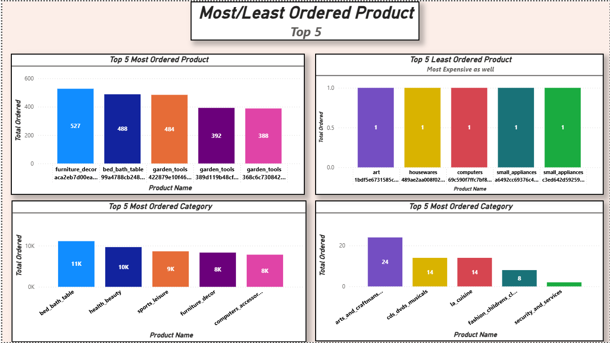

# Brazilian E-Commerce Analysis:
---
- The Brazilian E-Commerce is a public dataset of orders made at Olist Stores
- This has information of **100k orders from 2016-2018**
- Its features allows viewing an order from multiple dimensions:
    - Order Status
    - Price
    - Payment 
    - Freight performance to customer location, 
    - Product Attributes
    - Reviews written by Customers
---

# Analysis
---
## What is the Most/Least common payment type?

### What does the Dashboard say?
1. Credit card dominates Olist's payments mix at ~74% of orders, followed by boleto ~19% of orders. Vouchers and debit card are marginal at under ~8% combined. This suggest that credit card functionality (especially installments) is the path for the business
### Why does this matter?
1. It reveals 73.92% of flows through one payment rail, any friction in the rail(failed transactions, security issue, or checkout bugs) hits three-quarters of the business.
2. This also tells us that we should prioritize: **Credit Card -> Boleto -> Voucher/Debit Card**
### What should we do?
1. We should prioritize/invest in credit cards experience:
    1. Make sure there is less friction when customers ordering with credit cards
    2. Making sure payment installment option are reliable and prominent.
2. Don't deprioritize Beleto and Vouchers - maintain it:
    1. approximately ~25% of the user base uses both combined. Distinct consumer bases still uses it, not considered left over.
3. We should deprioritize Debit Card - But don't remove it:
    1. ~2% of user bases uses debit cards. So optimizing it would provide negligible ROI.

## Which products/product categories were the most/least Ordered?

### What product and product category was most Ordered?
1. 

## Which Location has the Most/Least Customers/Sellers?

### What does this tell us about Olist's geography?
1. From the bar chart we can see that the same four states: SP, RJ, MG, and PR are dominating both customers and sellers populations. While we have outliers such as RS which has the fourth most customers and SC which has the fourth most sellers. 

### What should we do?
1. We should redistribute some of the sellers from lower populated cities and states to states and city with higher customers. For example: 
    1. RJ state has approximately 13,000 customers and has the second most state with customers, meaning their is more demand there. But it has the fifth most state with sellers.
    2. PR has approximately 5,000 customers and has the fifth most state with customers, but it has 349 sellers the second most state with sellers. etc. 
2. For States we should(estimating based of rankings):
    1. Move Sellers from PR to RJ. About 120.
    2. Move Sellers from SC to RS. About 50. 
3. For Cities we should(estimating based on rankings):
    1. Move Sellers from Curitiba(-40 sellers) to Rio De Janeiro(+20 sellers) and Belo Horizonte(+20 sellers).
    2. Move Sellers to Brasilia from cities that has outside the rankings. 

---