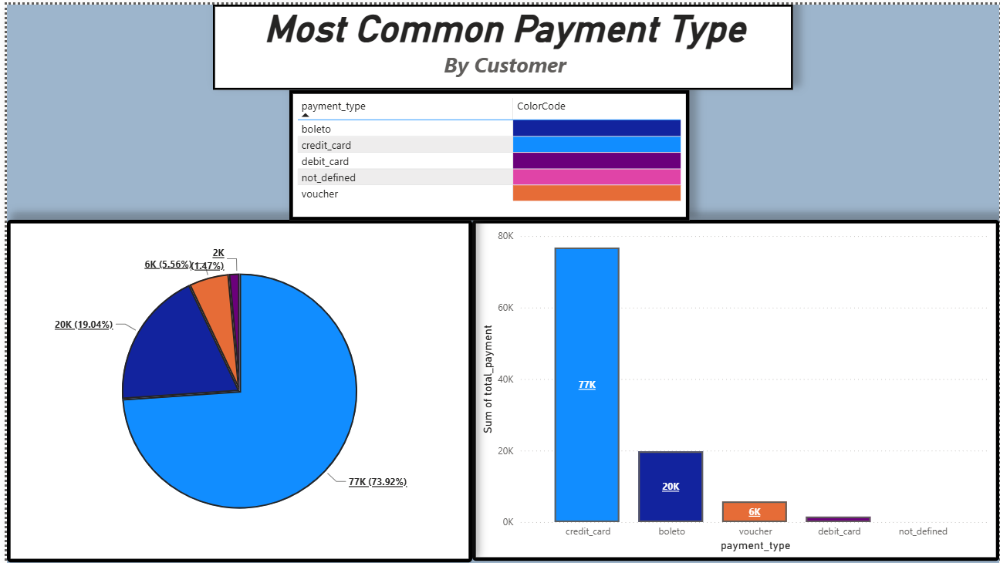
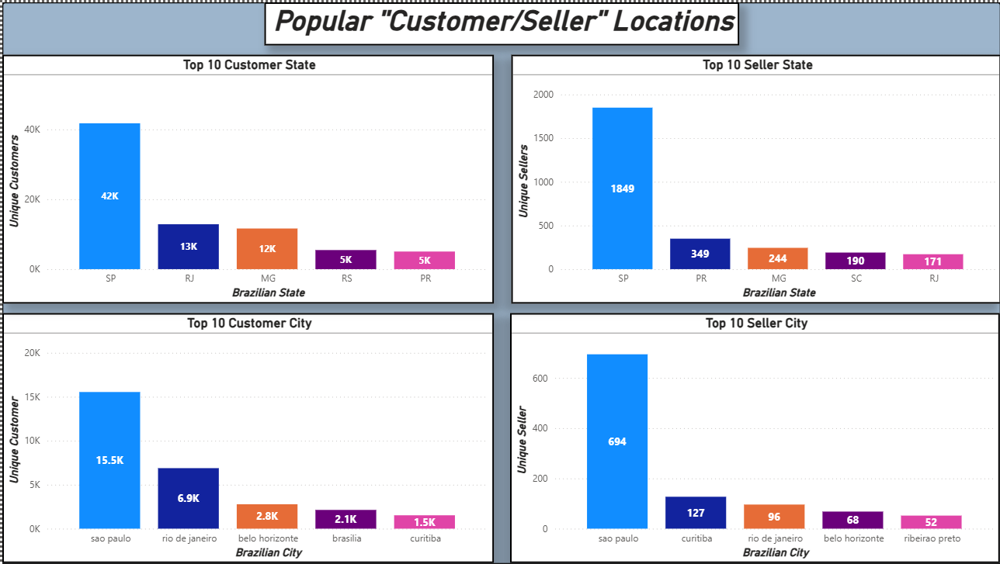

# Brazilian E-Commerce Analysis:
---
- The Brazilian E-Commerce is a public dataset of orders made at Olist Stores
- This has information of **100k orders from 2016-2018**
- Its features allows viewing an order from multiple dimensions:
    - Order Status
    - Price
    - Payment 
    - Freight performance to customer location, 
    - Product Attributes
    - Reviews written by Customers
---

# Analysis
---
## What is the Most/Least common payment type?

### What does the Dashboard say?
1. From the dashboard we can see: 
    1. Most commonly used payment type is **Credit Card**. 77k(73.92%) of customers
    2. Least commonly(known) used payment type is **Debit Card**. 2k(1.92%) of customers using it
    3. Note that I didn't used **undefined** as the least used because we don't what that it is. Is it Cash? Loaning? 
### Why is Credit Card the most used and Debit Card the least used?
1. There is many reasons why one will use credit card over a debit card:
    1. Credit cards provides better fraud and unauthorized transaction protection.
    2. Credit cards can provide rewards, travel points, and discounts.
    3. Helps you build credit allowing lower interest rates of products.

## Which Location has the Most/Least Customers/Sellers?

### What does the Dashboard say?
1. From the dashboard we can see:
    1. **Sao Paulo(State) and Sao Paulo(City)** both contains the most customers and sellers. 
    2. **Rio de Janeiro(State) and Rio de Janeiro(City)** contains the second most customers, but contains fifth most sellers.
    3. **MG(State) and Belo Horizonte(City in MG)**  third most state with customers and seller, and third most city with customers and fourth most seller in city. 
    4. **RS(State) and brasilia(capital city of brazil)** Contains the fourth most customers and **SC(State) and Belo Horizonte(City in MG)**
---