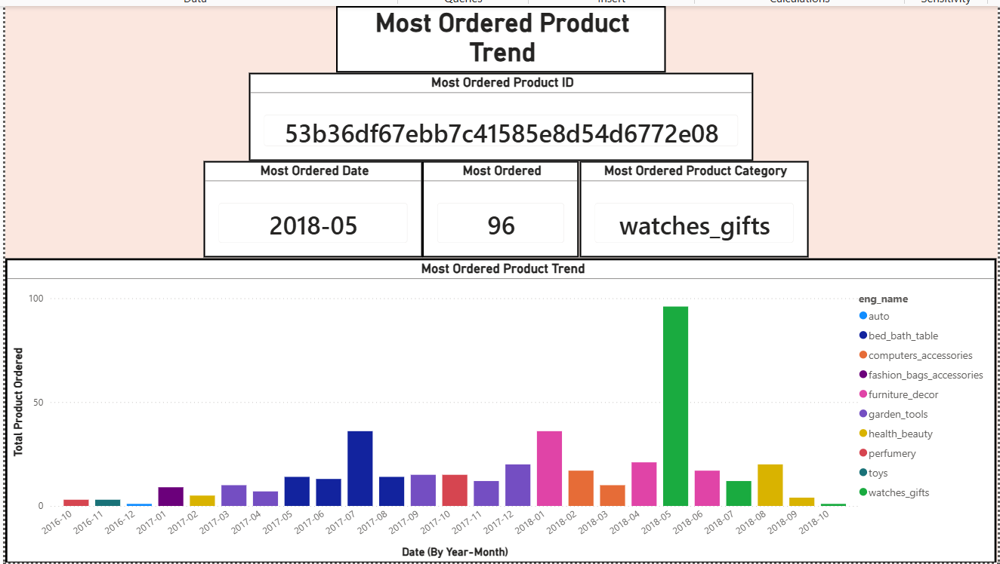
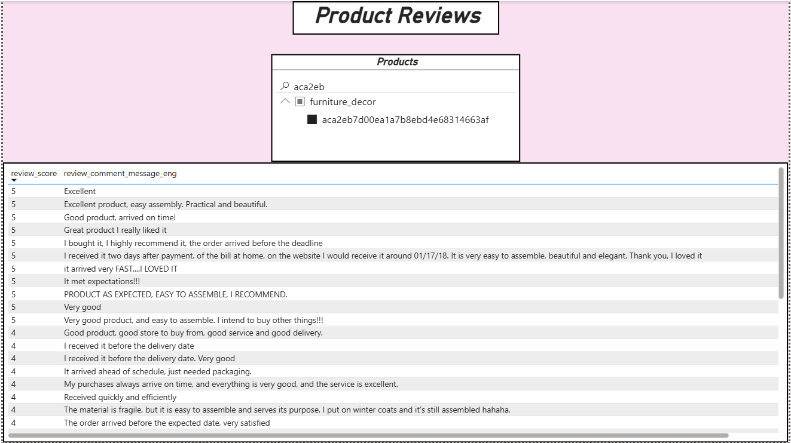
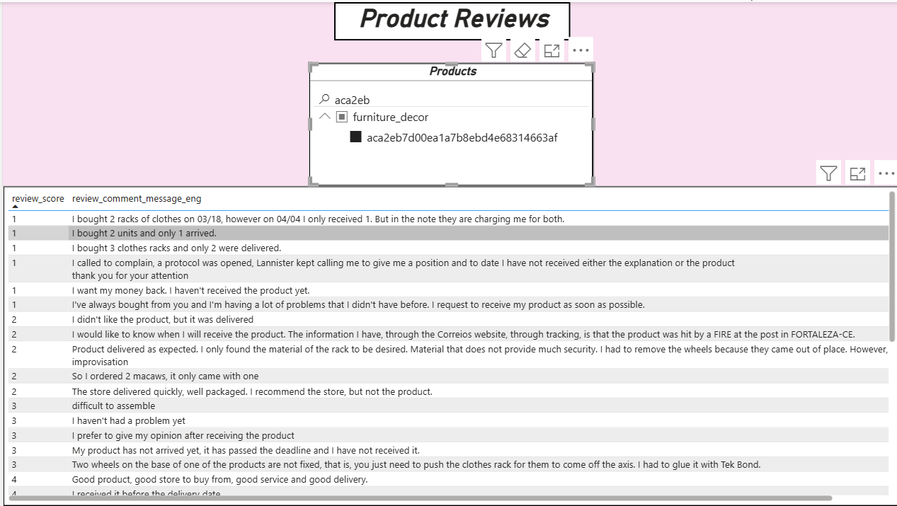
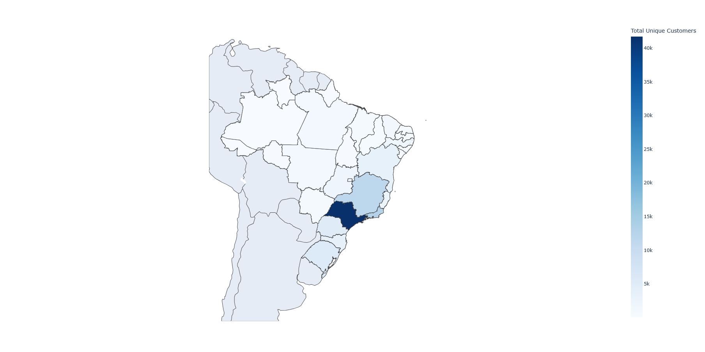
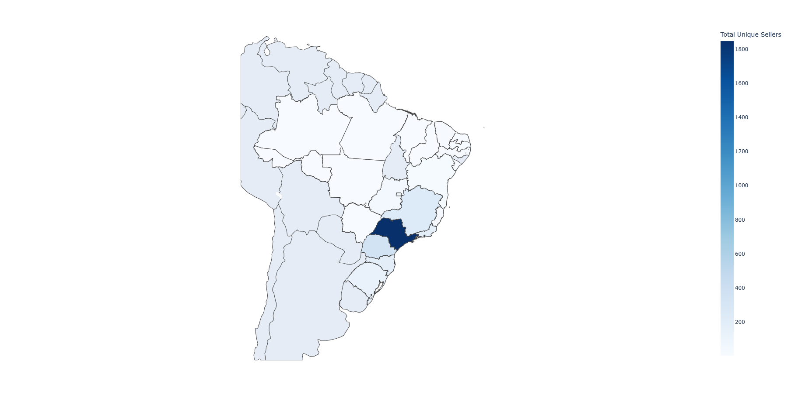

# Brazilian E-Commerce Analysis:
---
- The Brazilian E-Commerce is a public dataset of orders made at Olist Stores
- This has information of **100k orders from 2016-2018**
- Its features allows viewing an order from multiple dimensions:
    - Order Status
    - Price
    - Payment 
    - Freight performance to customer location, 
    - Product Attributes
    - Reviews written by Customers
---

# Analysis
---
## What is the Most/Least common payment type?

### What is the most used payment method?
1. Credit card dominates Olist's payments mix at ~74% of orders, followed by boleto ~19% of orders. Vouchers and debit card are marginal at under ~8% combined. This suggest that credit card functionality (especially installments) is the path for the business
### Why does this matter?
1. It reveals 73.92% of flows through one payment rail, any friction in the rail(failed transactions, security issue, or checkout bugs) hits three-quarters of the business.
2. This also tells us that we should prioritize: **Credit Card -> Boleto -> Voucher/Debit Card**
### What should we do?
1. We should prioritize/invest in credit cards experience:
    1. Make sure there is less friction when customers ordering with credit cards
    2. Making sure payment installment option are reliable and prominent.
2. Don't deprioritize Beleto and Vouchers - maintain it:
    1. approximately ~25% of the user base uses both combined. Distinct consumer bases still uses it, not considered left over.
3. We should deprioritize Debit Card - But don't remove it:
    1. ~2% of user bases uses debit cards. So optimizing it would provide negligible ROI.

## Which products/product categories were the most/least Ordered?

### What product and product category was most Ordered?

1. **Product**:
    1. **What is the Most Ordered Product?**:
        1. From 2016-2018, aca2eb7d00ea1a7b8ebd4e68314663af(a Furniture Decor) is the most ordered of all time, and from the trend we can see 2018-01 and started to trend downward hitting its low at 2016-06.
    2. **Why was it popular and why did it start losing popularity?**
        1. From the good reviews, we can see that the customers loved the product. It is easy to assemble, delivered on time, and looks pretty. 
        
        2. From the bad reviews, customers were dissatisfied by the service rather then the product. Complaints mainly stems from customers not receiving the product they desired.
        
    2. Least/Most Expensive:
        1. 

## Which State has the Most/Least Customers/Sellers?

### What does this tell us about Olist's geography?
1. From the bar chart we can see that the same four states: SP, RJ, MG, and PR are dominating both customers and sellers populations. While we have outliers such as RS which has the fourth most customers and SC which has the fourth most sellers. 

2. **Customers**
    1. From the map we can also notice that the population of customers are heavily concentrated in the southeast area.

3. **Sellers**
    1. Similarly to the customers population. Sellers are concentrated in the southeast area as well

### What should we do?
1. While it is positive that both sellers and customers are concentrated in southeastern Brazil, the distribution of sellers within that region should be improved. Specifically, this concerns RJ (2nd in customers, 5th in sellers), PR (2nd in sellers, 5th in customers), SC (4th in sellers, but not top 5 in customers), and RS (4th in customers, but not top 5 in sellers). But overall 

---